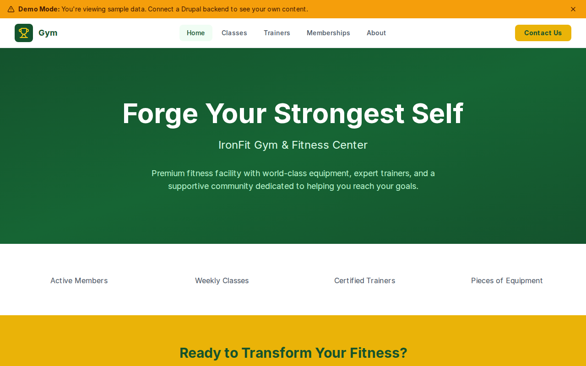

# Decoupled Gym

A fitness center website built with Next.js and Decoupled Drupal, designed for gyms, fitness studios, and health clubs to showcase classes, trainers, and membership plans.



[](https://vercel.com/new/clone?repository-url=https://github.com/nicholasio/decoupled-gym&project-name=decoupled-gym)

## Features

- Browse group fitness **classes** with difficulty levels, schedules, and instructor info
- Meet certified **trainers** with specialties, certifications, and experience
- Compare **membership plans** with pricing, features, and included perks
- Dynamic homepage with hero section, statistics, and free trial call-to-action
- Static **pages** for about and FAQ

## Quick Start

### 1. Clone the template

```bash
npx degit nicholasio/decoupled-gym my-gym
cd my-gym
npm install
```

### 2. Run interactive setup

```bash
npm run setup
```

### 3. Start development

```bash
npm run dev
```

Visit [http://localhost:3000](http://localhost:3000)

---

## Manual Setup

<details>
<summary>Click to expand manual setup steps</summary>

### Authenticate with Decoupled.io

```bash
npx decoupled-cli@latest auth login
```

### Create a Drupal space

```bash
npx decoupled-cli@latest spaces create "IronFit Gym"
```

Note the space ID returned (e.g., `Space ID: 1234`). Wait ~90 seconds for provisioning.

### Configure environment

```bash
npx decoupled-cli@latest spaces env 1234 --write .env.local
```

### Import content

```bash
npm run setup-content
```

This imports the following sample content:

- **Classes:** HIIT Blast (Advanced), Power Spin (Intermediate), Strength Foundations (Beginner), Boxing Fit (Intermediate)
- **Trainers:** Marcus Johnson (Strength & Powerlifting), Sarah Kim (HIIT & Conditioning), David Chen (Boxing & Functional Training)
- **Memberships:** Basic ($29/mo), Premium ($59/mo, featured), Elite ($99/mo)
- **Pages:** About IronFit Gym, Frequently Asked Questions
- **Homepage:** Hero section, statistics (2,500+ Members, 60+ Classes, 15 Trainers, 200+ Equipment), and free trial CTA

</details>

## Content Types

### Fitness Class

Group fitness class offering.

| Field | Type | Description |
|-------|------|-------------|
| difficulty_level | string | Beginner, Intermediate, or Advanced |
| duration | string | Class duration |
| schedule | string | Weekly schedule |
| instructor_name | string | Lead instructor |
| image | image | Class photo |
| body | text | Full class description |

### Trainer

Personal trainer profile.

| Field | Type | Description |
|-------|------|-------------|
| specialty | string | Training specialty |
| email | string | Contact email |
| certifications | string | Professional certifications |
| experience_years | string | Years of experience |
| photo | image | Trainer headshot |
| body | text | Full biography |

### Membership Plan

Gym membership tier.

| Field | Type | Description |
|-------|------|-------------|
| price_monthly | string | Monthly price |
| includes | text | What the plan includes |
| featured | bool | Whether this is the recommended plan |
| image | image | Membership tier image |
| body | text | Plan description |

### Homepage

Landing page with hero section, statistics, and call-to-action areas.

| Field | Type | Description |
|-------|------|-------------|
| hero_title | string | Hero headline |
| hero_subtitle | string | Hero subheading |
| hero_description | text | Hero body text |
| stats_items | paragraph(stat_item)[] | Key statistics |
| featured_items_title | string | Featured section title |
| cta_title | string | CTA section title |
| cta_description | text | CTA body text |
| cta_primary | string | Primary button label |
| cta_secondary | string | Secondary button label |

### Basic Page

Static content pages for about, FAQ, policies, etc.

| Field | Type | Description |
|-------|------|-------------|
| body | text | Page content |

## Customization

### Colors & Branding

Edit `tailwind.config.js` to customize colors, fonts, and spacing for your gym's brand.

### Content Structure

Modify `data/gym-content.json` to update classes, trainers, memberships, and other sample content.

### Components

React components are in `app/components/`. Update them to match your fitness center's design and energy.

## Demo Mode

### Enable Demo Mode

Set the environment variable:

```bash
NEXT_PUBLIC_DEMO_MODE=true
```

Or add to `.env.local`:

```
NEXT_PUBLIC_DEMO_MODE=true
```

### What Demo Mode Does

- Shows a "Demo Mode" banner at the top of the page
- Returns mock data for all GraphQL queries
- Displays sample classes, trainers, memberships, and homepage content
- No Drupal backend required

### Removing Demo Mode

To convert to a production app with real data:

1. Delete `lib/demo-mode.ts`
2. Delete `data/mock/` directory
3. Delete `app/components/DemoModeBanner.tsx`
4. Remove `DemoModeBanner` from `app/layout.tsx`
5. Remove demo mode checks from `app/api/graphql/route.ts`

## Deployment

### Vercel (Recommended)

[](https://vercel.com/new/clone?repository-url=https://github.com/nicholasio/decoupled-gym)

Set `NEXT_PUBLIC_DEMO_MODE=true` in Vercel environment variables for a demo deployment.

### Other Platforms

Works with any Node.js hosting platform that supports Next.js.

## Documentation

- [Decoupled.io Docs](https://www.decoupled.io/docs)
- [Next.js Documentation](https://nextjs.org/docs)
- [Drupal GraphQL](https://www.decoupled.io/docs/graphql)

## License

MIT
